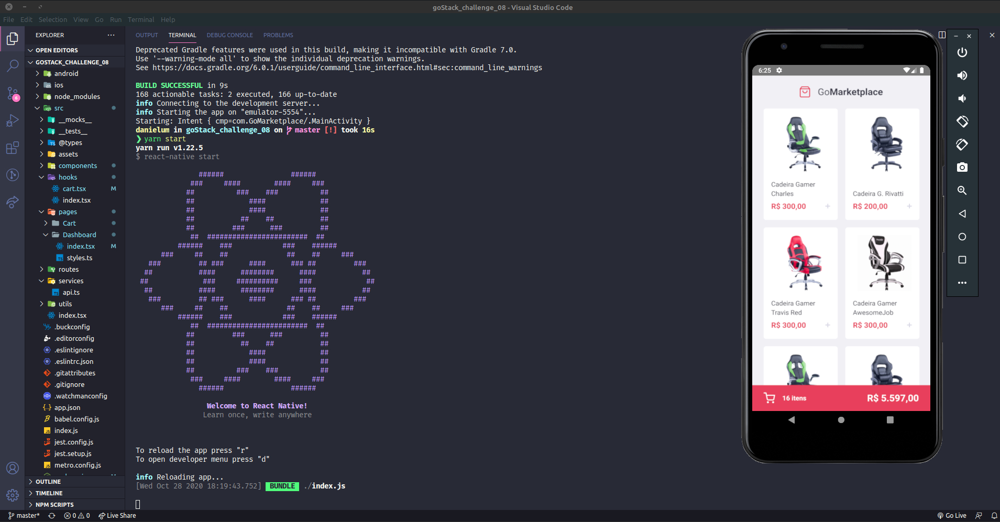

<h2 align="center">
  Desafio 07: GoMarketplace App :flying_saucer:
</h2>

  <a href="#rocket-desafio">Desafio</a>&nbsp;&nbsp;&nbsp;|&nbsp;&nbsp;&nbsp;
  <a href="#artificial_satellite-tecnologias">Tecnologias</a>&nbsp;&nbsp;&nbsp;|&nbsp;&nbsp;&nbsp;
  <a href="#gear-funcionalidades">Funcionalidades</a>&nbsp;&nbsp;&nbsp;|&nbsp;&nbsp;&nbsp;
  <a href="#gear-testes-aplicados-nesse-desafio">Testes</a>&nbsp;&nbsp;&nbsp;|&nbsp;&nbsp;&nbsp;
  <a href="#computer-como-contribuir">Como contribuir</a>&nbsp;&nbsp;&nbsp;|&nbsp;&nbsp;&nbsp;
  <a href="#file_folder-licença">Licença</a>

 

## :rocket: Desafio

Nesse desafio, o objetivo foi desenvolver uma nova aplicação chamada de GoMarketplace, e praticar o que aprendeu até agora com React Native, TypeScript, utilizando rotas, Async Storage e a Context API.

<h4 display="flex" align="center">
    
</h4>

## :artificial_satellite: Tecnologias

Esse projeto foi desenvolvido com as seguintes tecnologias:

- [React Native](https://reactnative.dev/)
- [Javascript](https://www.javascript.com/)
- [Typescript](https://www.typescriptlang.org/)
- [Outras](#)

## :gear: Funcionalidades

Como funcionalidades da aplicação, temos:

<strong>Listar os produtos da fake API:</strong>
Sua página Dashboard deve ser capaz de exibir uma listagem através de uma tabela, com os campos title, image_url e price.

<strong>Adicionar itens ao carrinho:</strong>
Em toda sua aplicação, você deve utilizar o Contexto chamado cart que deixamos disponível. Você vai precisar completar as funcionalidades dentro de hooks/cart.tsx para que você consiga adicionar itens ao carrinho.

<strong>Exibir itens do carrinho:</strong>
Na página Cart você deve exibir todos os itens do carrinho, junto com a quantidade, valor único, valor subtotal dos itens e total de todos os items.

<strong>Aumentar quantidade de itens do carrinho:</strong>
Na página Cart você deve permitir que o usuário aumente a quantidade de itens do mesmo produto, para isso você pode utilizar a função increment dentro do seu contexto em /src/hooks/cart.tsx.

<strong>Diminuir quantidade de um item do carrinho:</strong>
Na página Cart você deve permitir que o usuário decremente a quantidade de itens do mesmo produto, para isso você pode utilizar a função decrement dentro do seu contexto em /src/hooks/cart.tsx.

<strong>Exibir valor total dos itens no carrinho:</strong>
Tanto na página Dashboard, quanto na página Cart você deve exibir o valor total de todos os itens que estão no seu carrinho.

## :memo: Testes
 Em cada teste aplicado nesse desafio há uma breve descrição sobre quais quesitos a aplicação deve cumprir para que o teste passe:

<strong> should be able to list the total balance inside the cards: </strong>
Para que esse teste passe, sua aplicação deve permitir que seja exibido na sua Dashboard, cards contendo o total de income, outcome e o total da subtração de income - outcome que são retornados pelo balance do seu backend.

<strong> should be able to list the transactions: </strong>
Para que esse teste passe, sua aplicação deve permitir que sejam listados dentro de uma tabela, toda as transações que são retornadas do seu backend.

<strong> should be able to navigate to the import page: </strong>
Para que esse teste passe, você deve permitir a troca de página através do Header, pelo botão que contém o nome Importar.

<strong> should be able to upload a file: </strong>
Para que esse teste passe, você deve permitir que um arquivo seja enviado através do componente de drag-n-drop na página de import, e que seja possível exibir o nome do arquivo enviado para o input.

<strong>should be able to list the products: </strong>
Para que esse teste passe, sua aplicação deve permitir que sejam listados na sua tela Dashboard, todos os produtos que são retornadas do Fake API. Essa listagem deve exibir o title e o price que deve ser formatado utilizando a função Intl.

<strong>should be able to add a product to the cart: </strong>
Para que esse teste passe, você deve permitir que seja possível adicionar produtos da sua Dashboard ao carrinho, utilizando o contexto de cart disponibilizado.

<strong>should be able to list the products on the cart: </strong>
Para que esse teste passe, você deve permitir que seja possível listar os produtos que estão salvos no contexto do seu carrinho na página Cart, nessa página exiba o nome do produto e o subtotal total de cada produto (price * quantity).

<strong>should be able to calculate the cart total: </strong>
Para que esse teste passe, tanto na página Dashboard, tanto na página Cart você deve exibir o valor total de todos os itens que estão no seu carrinho.

<strong>should be able to show the total quantity of itens in the cart: </strong>
Para que esse teste passe, tanto na página Dashboard, tanto na página Cart você deve exibir o número total de itens que estão no seu carrinho.

<strong>should be able to increment product quantity on the cart: </strong>
Para que esse teste passe, você deve permitir que seja possível incrementar a quantidade de um produto do seu carrinho, utilizando o contexto de cart disponibilizado.

<strong>should be able to decrement product quantity on the cart: </strong>
Para que esse teste passe, você deve permitir que seja possível decrementar a quantidade de um produto do seu carrinho, utilizando o contexto de cart disponibilizado.

<strong>should be able to navigate to the cart: </strong>
Para que esse teste passe, no seu componente FloatingCart na Dashboard, você deve permitir que ao clicar no botão de carrinho com o testID de navigate-to-cart-button, o usuário seja redirecionado para a página Cart.

<strong>should be able to add products to the cart: </strong>
Para que esse teste passe, no seu arquivo onde contém o contexto do carrinho, você deve permitir que a função addToCart adicione um novo item ao carrinho.

<strong>should be able to increment quantity: </strong>
Para que esse teste passe, no seu arquivo onde contém o contexto do carrinho, você deve permitir que a função increment incremente em 1 unidade a quantidade de um item que está armazenado no contexto.

<strong>should be able to decrement quantity: </strong>
Para que esse teste passe, no seu arquivo onde contém o contexto do carrinho, você deve permitir que a função decrement decremente em 1 unidade a quantidade de um item que está armazenado no contexto.

<strong>should store products in AsyncStorage while adding, incrementing and decrementing: </strong>
Para que esse teste passe, no seu arquivo onde contém o contexto do carrinho você deve permitir que todas as atualizações que você fizer no carrinho, sejam salvas no AsyncStorage. Por exemplo, ao adicionar um item ao carrinho, adicione-o também no AsyncStorage. Lembre de também atualizar o valor do AsyncStorage quando você incrementar ou decrementar a quantidade de um item.

<strong>should load products from AsyncStorage: </strong>
Para que esse teste passe, no seu arquivo onde contém o contexto do carrinho, você deve permitir que todos os produtos que foram adicionados sejam buscados do AsyncStorage.

## :computer: Como contribuir
- Faça um fork desse repositório;
- Cria uma branch com a sua feature: git checkout -b minha-feature;
- Faça commit das suas alterações: git commit -m 'feat: Minha nova feature';
- Faça push para a sua branch: git push origin minha-feature.
- Depois que o merge da sua pull request for feito, você pode deletar a sua branch.

## :file_folder: Licença
Esse projeto está sob a licença MIT. Veja o arquivo [LICENSE](LICENSE.md) para mais detalhes.

 

#### 
#usemascara :mask: 

